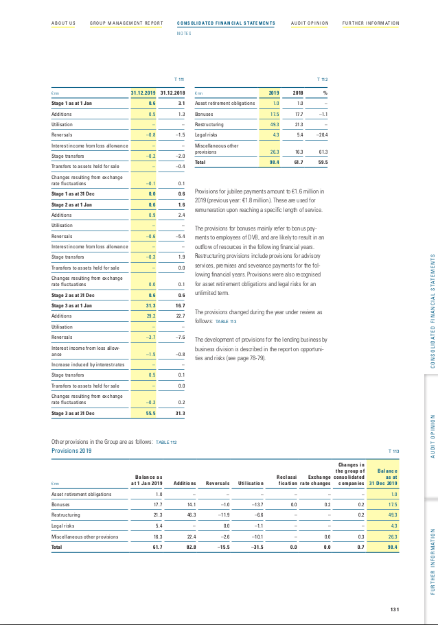
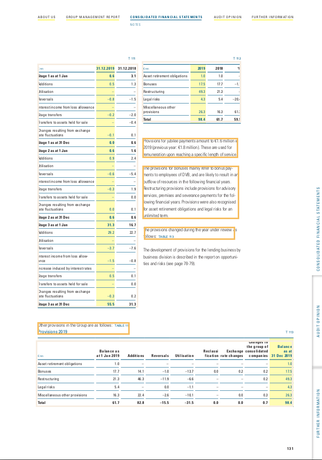

<h2 align="center">Document Layout</h2>

### Installation:

**Clone the repository**

and move into working directory

```git clone https://github.com/Hemantr05/ML_APIs && cd doc_layout```

**Setting up yolov3**

```bash setup.sh```


## Start server:

1. **Using uvicorn:**

    ```uvicorn main:app --reload --host 127.0.0.1 --port 8000```

2. **Using hypercorn:**

    ```hypercorn main:app --reload```

## Usage:
    
**Swagger UI:**

Open http://127.0.0.1:8000/docs in your browser


## Result:

 
